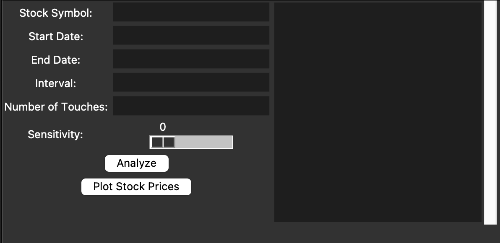
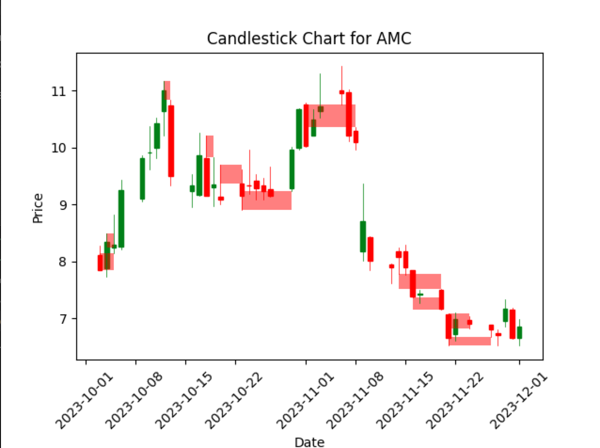

<h3 align="center">Stock Analysis GUI</h3>

  <p align="center">
    Analyzes individual stocks to determine supports, resistances, demand zones, and supply zones on a stock chart. Contains a notification system that notifies users when a stock reaches a certain percentage away from these zones.
    <br />
    <a href="https://github.com/kevle0215/StockAnalysisGUI/issues">Report Bug</a>
    ·
    <a href="https://github.com/kevle0215/StockAnalysisGUI/issues">Request Feature</a>
  </p>
</div>

<!-- TABLE OF CONTENTS -->
<details>
  <summary>Table of Contents</summary>
  <ol>
    <li>
      <a href="#about-the-project">About The Project</a>
      <ul>
        <li><a href="#built-with">Built With</a></li>
      </ul>
    </li>
    <li>
      <a href="#getting-started">Getting Started</a>
    </li>
    <li><a href="#usages">Usages</a></li>
    <li><a href="#features">Features</a></li>
    <li><a href="#contributing">Contributing</a></li>
    <li><a href="#contact">Contact</a></li>
  </ol>
</details>

<!-- ABOUT THE PROJECT -->
## About The Project

### Built With
* Python
  * tkinter
  * yfinance
  * unittest/mock
* SQL
  * sqlite3

<!-- GETTING STARTED -->
## Getting Started
1. Clone the repo
   ```sh
   git clone https://github.com/kevle0215/StockAnalysisGUI.git
   ```
2. Run the `DatabaseConfiguration.py` file to configure the appropriate databases on your local machine.

<!-- USAGES -->
## Usages

### Individual Stock Analysis


| Label | Meaning | Constraints |
| ---------| ---------| ---------|
| Stock Symbol | Abbreviated stock symbol as shown by Yahoo.com.  | Only stocks that are tracked by Yahoo will be contained in the stock symbol directory. |
| Start Date | Earliest date to extract data from. | Must be in the form YYYY-MM-DD and cannot exceed IPO of company. |
| End Date | Latest date to extract data from. | Must be in the form YYYY-MM-DD. |
| Interval| Data collecting interval. | Includes the interavls 1m, 2m, 5m, 15m, 30m, 60m, 90m, 1h, 1d, 5d, 1wk, 1mo, 3mo. |
| Number of Touches | The number of times price has to hit a support and resistance region to be considered valid.  | N/A |
| Sensitivity | Determines the granularity of the supports and resistances. Lower sensitivity leads to larger support and resistance and resistance regions. The slider corresopnds to price being 4%, 2%, 1%, 0.5%, and 0.25% away from the lowerbound of the support and resistance region. | Must be a value between 0 and 4, inclusive. |

**Buttons**
1. **[Analyze]** will output the support and resistances in the form of [Lowerbound, Upperbound] in the black box to the right.

2. **[Plot Stock Prices]** will illustrate the supports and resistances on a candlestick chart, displayed on a new window (shown below).



### Notification System GUI
The input values carry the same meanings and restrictions as that seen in the [Individual Stock Analysis Section](#individual-stock-analysis). 

**Buttons**
1. **[Create New Notification]**: Creates a new notification with all supports and resistances (in the given date range) in the *support_resistance* table and the current price support and resistance boundaries in the *stock_boundaries* table.
   
2. **[Delete Notification]**: Removes the stock from the *support_resistance* table and *stock_boundaries* table, effectively removing the notification altogether.

3. **[Start Stop Notifications]** Starts and stops the notifications by toggling the truth value in the *script_state* table. This value is checked by `NotificationScript.py` in order for the script to actively send notifications.

4. **[Manually Add Support And Resistance]** Add support and resistance regions to the *support_resistance* table if the `SupportResistance.py` file does not detect them.

### Scripts
The `NotificationScript.py` should be constantly running in the background and will automatically notify the user when the stock is approaching a support or resistance zone. To avoid large runtimes, the stock's live price is only checked against the boundaries defined in the *stock_boundaries* table, which is automatically updated when support or resistance is broken. If there exists no support or resistance beyind the broken one, the 365 day low and high will be considered as the support and resistance, respectively.

Run the `UpdateSupportResistance.py` script after every live market session to update the *support_resistance* table.

<p align="right">(<a href="#readme-top">back to top</a>)</p>

<!-- Features -->
## Features

1. Individual stock support and resistance analysis paired visually with candlestick stock chart.
2. Storing of all support and resistance zones in SQL database for easy access.
3. Notification and update scripts to notify users of a stock's closeness to a support or resistance zone.
4. Contains test files for code related to the notification system. 

<p align="right">(<a href="#readme-top">back to top</a>)</p>


<!-- CONTRIBUTING -->
## Contributing

Any contributions you make are **greatly appreciated**.

If you have a suggestion that would make this better, please fork the repo and create a pull request. You can also simply open an issue with the tag "enhancement".

<p align="right">(<a href="#readme-top">back to top</a>)</p>

<!-- CONTACT -->
## Contact

Kevin Lee - [Linkedin](https://www.linkedin.com/in/kevin-lee-3902a317a/) - [Email](kl441@duke.edu)

Project Link: [https://github.com/kevle0215/StockAnalysisGUI](https://github.com/kevle0215/StockAnalysisGUI)

<p align="right">(<a href="#readme-top">back to top</a>)</p>